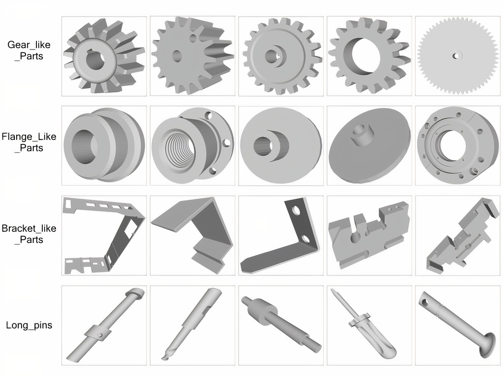
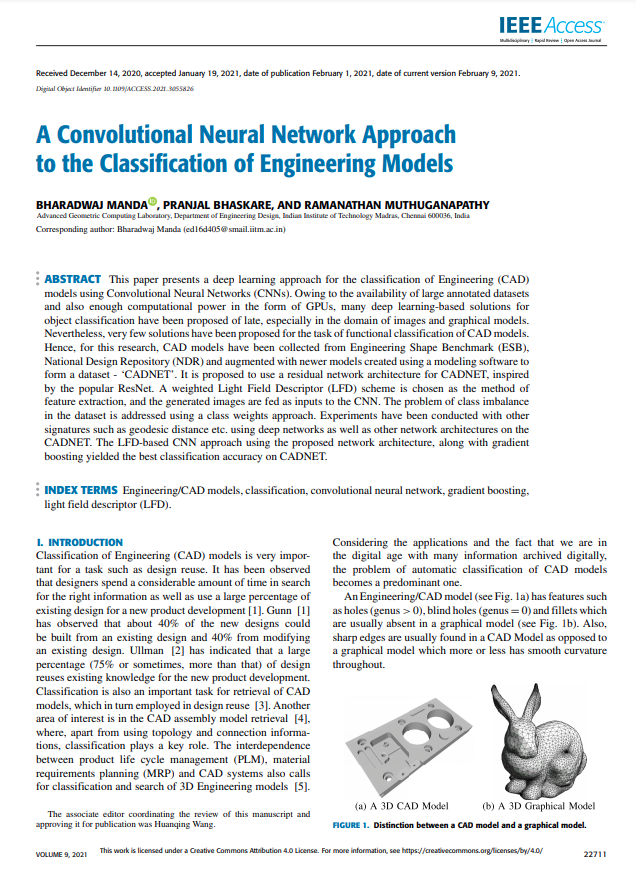

# News

> **(2021, January 21)** This is the repository for the 'CADNET' Dataset, associated with the paper ["A Convolutional Neural Network Approach to the Classification of Engineering Models"](https://ieeexplore.ieee.org/document/9343314). For further details, contact Bharadwaj Manda via [here](https://www.linkedin.com/in/bharadwaj-manda-9730ab114/) or [here](https://bharadwaj-manda.netlify.app/)

## CADNET Dataset



We introduce the CADNET dataset, which is an annotated collection of 3,317 3D Engineering models over 43 categories. Owing to the availability of large annotated datasets and also enough computational power in the form of GPUs, many deep learning-based solutions for object classification have been proposed of late, especially in the domain of images and graphical models. Nevertheless, very few solutions have been proposed for the task of functional classification of CAD models. Hence, for this research, CAD models have been collected from Engineering Shape Benchmark (ESB), National Design Repository (NDR), and augmented with newer models created using a modeling software to form a dataset - ‘CADNET’.

## Download

Download the dataset [here](Download the Dataset [here](https://drive.google.com/file/d/1JpYHRy2hgOL1X1z9HNIcHv7v-PSJqxaC/view?usp=sharing))


## Authors

Manda, Bharadwaj and Bhaskare, Pranjal and Muthuganapathy, Ramanathan


## Paper/Citation

<a href="https://ieeexplore.ieee.org/stamp/stamp.jsp?tp=&arnumber=9343314" target="_blank"></a>

Please cite our paper if you use the CADNET dataset.

```bibtex
@ARTICLE{9343314,  
author={Manda, Bharadwaj and Bhaskare, Pranjal and Muthuganapathy, Ramanathan},  
journal={IEEE Access},   
title={A Convolutional Neural Network Approach to the Classification of Engineering Models},   
year={2021},  
volume={9},  
number={},  
pages={22711-22723},  
doi={10.1109/ACCESS.2021.3055826}}
```

## Acknowledgements

We are grateful to the teams of ESB and NDR for making their datasets available. Thanks are also due to the many members who have contributed 3D CAD models to the CADNET dataset.

### License

This dataset is licensed under CC BY-NC-SA: Creative Commons Attribution-NonCommercial-ShareAlike 4.0 International This license is one of the Creative Commons licenses and allows users to share the dataset only if they (1) give credit to the copyright holder, (2) do not use the dataset for any commercial purposes, and (3) distribute any additions, transformations or changes to the dataset under this same license.

